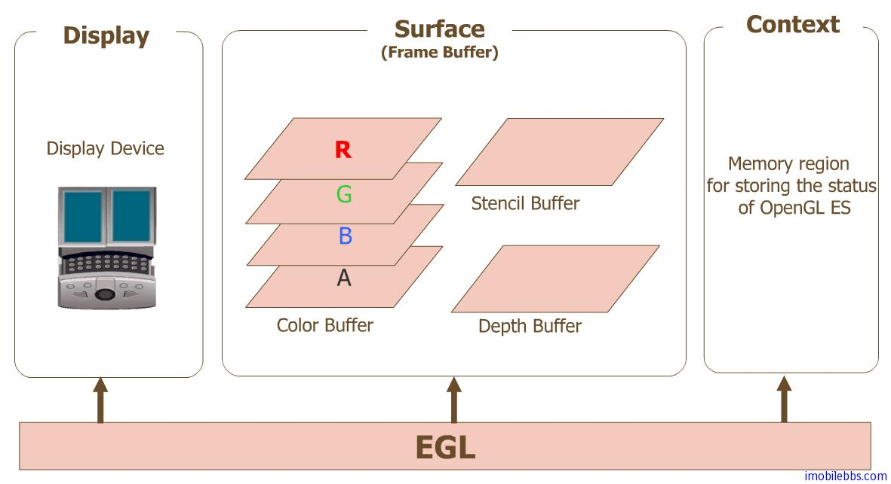

# Android EGL 实践

> 本项目为 ``SurfaceView`` 和 ``TextureView`` 封装了 EGL 环境管理以及 Render 线程，可以和 ``GLSurfaceView`` 一样使用 OpenGLES 进行渲染。并尝试使用 OpenGLES 绘制了一个三角形验证正确性。

## 一、EGL 原理

EGL 是 OpenGL ES 和本地窗口系统（Native Window System）之间的通信接口，它的主要作用如下：

- 与设备的原生窗口系统通信。
- 查询绘图表面的可用类型和配置。
- 创建绘图表面。
- 在OpenGL ES 和其他图形渲染API之间同步渲染。
- 管理纹理贴图等渲染资源。

Android EGL的架构图如下：

- Display 是对实际显示设备的抽象。代码中对应 ``EGLDisplay``。

- Surface 是对用来存储图像的内存区域 FrameBuffer 的抽象，包括 Color Buffer， Stencil Buffer ，Depth Buffer。代码中对应 ``EGLSurface``。

- Context存储 OpenGL ES 绘图的一些状态信息。代码中对应 ``EGLContext``。

## 二、EGL 实践

### 1.EGL 环境创建

EGL 环境创建主要是操作 EGLDisplay、EGLSurface 和 EGLContext。一般步骤如下：

1. 使用``eglGetDisplay(EGL_DEFAULT_DISPLAY)``获取 EGLDisplay，并调用``eglInitialize``方法执行初始化，**建立起与本地窗口系统的连接**。

2. 调用``eglChooseConfig``方法，确定渲染表面的配置信息。

3. 创建 EGLContext：``eglCreateContext``。

4. 使用 ``ANativeWindow`` 创建 ``EGLSurface``。

5. 绑定上下文：``eglMakeCurrent(eglDisplay_, eglSurface_, eglSurface_, eglContext_)``

6. 交换缓冲：``eglSwapBuffers(eglDisplay_, eglSurface_)``，执行后即可看到渲染的内容。

7. 退出时需要释放EGL环境。

### 2.代码实现

实现思路：在Java层封装了``NativeRenderer``类，用于处理与Native层的交互以及兼容``SurfaceView``和``TextureView``，并使用了一个``HandlerThread``来做渲染线程。借助``Choreographer``将每帧的回调传递到了Native，实现类似于``View.onDraw``方法。

从``SurfaceView``和``TextureView``获取的 Surface 非常重要，从 Surface 获取 ANativeWindow 才能完成这两个 View 与 EGL 环境的绑定。具体参考：[EGLSurface 和 OpenGL ES](https://source.android.com/docs/core/graphics/arch-egl-opengl)。

EGLHelper 参考了 GLSurfaceView.EglHelper 的实现，完成了 EGL 环境创建。

参考文档：[OpenGL ES 共享上下文实现多线程渲染 - 掘金](https://juejin.cn/post/6969580005151997989)。